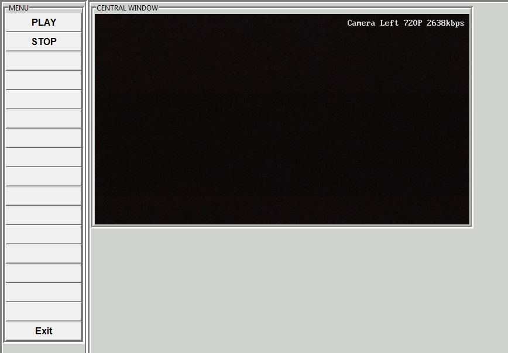
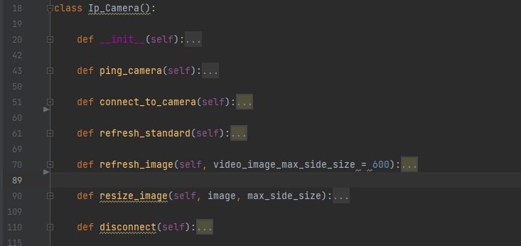

# IP_Camera
IP Camera in Tkinter GUI

Before start configure your camera in camera operation class named: "IP_Camera()".

You will find it in "resources/video" folder.

The IP_Camera class:

* __init__() > configuration data (IP, PORT, User, Pass)
* ping_camera() > check connection to camera on start. If not, video won't start.
* connect_to_camera() > in there is ping to camera > set connection
* refresh_standard() > this works without Tkinter GUI. Run ip_cam.py file instead main.py and see.
* refresh_image() > this is refresh function for rTkinter GUI.

The GIU interface is based on:
https://github.com/a5892731/GUI_template

**Licence:**

This is open source code. Use it however you like :)